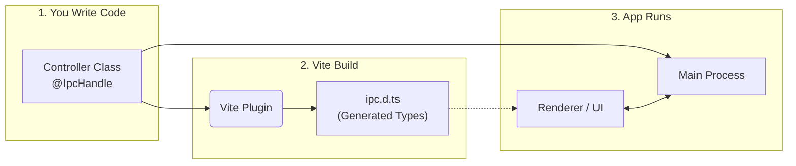

  

# Electron IPC Controller

## Overview

A **type-safe, class-based** IPC framework for Electron applications.

Inspired by NestJS, this library allows you to structure your Electron Main Process logic using **Controllers** and **Decorators**. It includes a Vite plugin that automatically generates TypeScript definitions for your Renderer process, ensuring your renderer and main process types are always in sync without manual duplication.

- Channels become an implementation detail. They're dynamically generated when the app is created, and automatically passed to the preload script.
- The `IpcMainEvent`/`IpcMainInvokeEvent` is abstracted away by default, but easily accessible with the `@RawEvent` decorator
- Types are auto-generated for the renderer process, meaning you don't need to manually create shared DTOs
- You never need to touch `ipcMain.handle(...)` or `ipcRenderer.invoke(...)`
- There's no need for manual preload wire-up
- Easy mapping from a class-based structure into Electron's IPC mechanisms

## How It Works



This library consists of two main parts working in tandem:

1. **Runtime (`@electron-ipc-controller/core`):**

- Uses TypeScript decorators to register class methods as `ipcMain` handlers.
- Handles parameter injection (e.g., getting the `BrowserWindow` or `WebContents` directly in your method).
- Manages the `preload` script to expose a type-safe API bridge.

2. **Build-time (`@electron-ipc-controller/vite-plugin`):**

- Statically analyzes your Controller classes.
- Generates:
  - a runtime TypeScript module with your IPC API and shared types
  - a `d.ts` declaration file that augments `window` with that API
- Ensures that if you change a method signature in the backend, the frontend build will fail if not updated.

### Mental Model

- Controllers live in the Main process
- Methods become IPC endpoints
- The preload exposes a safe, typed facade
- The renderer only ever talks to `window.ipc`

## Motivation

After building my own non-trivial Electron app, I found that too much time was spent updating the preload script and renderer types. Defining constants for channel names, shared configs for API types. I originally built a much simpler version of this library for my own use, but thought genericising it and publishing it may help others who took a class-based approach to their application's backend.

---

## Quickstart

### 1. Installation

```bash
pnpm add @electron-ipc-controller/core reflect-metadata
pnpm add -D @electron-ipc-controller/vite-plugin

```

### 2. Configure typescript

Ensure your tsconfig.json has the following options enabled to support decorators:

```json
{
  "compilerOptions": {
    "experimentalDecorators": true,
    "emitDecoratorMetadata": true
  }
}
```

_Note: You must import `reflect-metadata` at the very top of your application entry point._

### 3. Configure Vite (for Type Generation)

This is optional, but without it you lose type generation. Add the plugin to your `vite.config.ts`.

```typescript
import { electronIpcController } from "@electron-ipc-controller/vite-plugin";

export default {
  plugins: [
    electronIpcController({
      main: "src/main/index.ts", // Path to your main process entry
      // Optional – customize where types are generated
      types: {
        runtime: "src/renderer/src/ipc.types.ts", // importable module
        global: "src/ipc.d.ts", // ambient Window augmentation
      },
    }),
  ],
};
```

### 4. Create a Controller

Define a class to handle IPC messages.

```typescript
// src/main/maths.controller.ts
import { IpcController, IpcHandle } from "@electron-ipc-controller/core";

@IpcController("mathematics")
export class MathsController {
  @IpcHandle()
  async add(a: number, b: number): Promise<number> {
    return a + b;
  }
}
```

### 5. Register in Main Process

```typescript
// src/main/index.ts
import "reflect-metadata";

import { createIpcApp } from "@electron-ipc-controller/core";
import { MathsController } from "./maths.controller";

const app = createIpcApp({
  controllers: [MathsController],
  resolver: {
    resolve: (Cls) => new Cls();
  },
});
```

### 6. Setup Preload Script

Expose the API to the renderer.

```typescript
// src/preload/index.ts
import { setupPreload } from "@electron-ipc-controller/core/preload";

setupPreload();
```

### 7. Use in Renderer

The types are automatically generated! In your renderer process, they will look something like this

```ts
// src/renderer/ipc.types.ts
// Auto-generated by @electron-ipc-controller/vite-plugin
// Do not edit manually

export interface IpcApi {
  mathematics: {
    add(a: number, b: number): Promise<number>;
  };
}
```

```ts
// src/ipc.d.ts
// Auto-generated by @electron-ipc-controller/vite-plugin
// Do not edit manually

import type { IpcApi } from "./renderer/ipc.types";

declare global {
  interface Window {
    ipc: IpcApi;
  }
}

export {};
```

```typescript
// src/renderer/App.tsx
const result = await window.ipc.mathematics.add(5, 10);
console.log(result); // 15
```

---

## Decorators

### Class Decorators

#### `@IpcController(namespace?: string)`

Marks a class as an IPC controller. Without this decorator, no methods on the class will be bound.

`namespace` is optional, and defines the API namespace for the controller's methods.

```ts
// Would resolve to window.ipc.users in the renderer
@IpcController("users")
class MyFunController {
  // ...
}
```

```ts
// Would resolve to window.ipc.myFun in the renderer
// The Controller suffix is removed, and converted to camelCase
@IpcController()
class MyFunController {
  // ...
}
```

### Method Decorators

These decorators register methods to listen for IPC events. Types are generated for these methods and exposed to the renderer.

#### `@IpcHandle(name?: string)`

Registers a **bidirectional** handler (Request/Response) using `ipcMain.handle`.

`name` is optional, and defines the API schema in the same way as the controller decorator.

```ts
@IpcController()
class SettingsController {
  // Would resolve to window.ipc.settings.get() in the renderer
  @IpcHandle("get")
  methodName() {}
}
```

```ts
@IpcController()
class SettingsController {
  // Would resolve to window.ipc.settings.methodName() in the renderer
  @IpcHandle()
  methodName() {}
}
```

#### `@IpcOn(name?: string)`

Registers a **one-way** listener using `ipcMain.on`.

- **Usage:** For fire-and-forget events where the renderer doesn't wait for a result.
- **Naming:** Same rules as `@IpcHandle`.
- The renderer **does not receive a return value**
- The generated renderer method returns `void`
- Internally uses `ipcRenderer.send`

#### `@IpcHandleOnce` & `@IpcOnce`

Same as above, but the listener is removed after the first trigger.

---

## Parameter Decorators

You can inject Electron-specific context directly into your controller methods without parsing the raw `event` object manually.

| Decorator        | Injects                                                                                                            | Type                                                                                                                                                                                          |
| ---------------- | ------------------------------------------------------------------------------------------------------------------ | --------------------------------------------------------------------------------------------------------------------------------------------------------------------------------------------- |
| `@Sender`        | **Nullable**. The `WebContents` that sent the message                                                              | [`WebContents`](https://www.electronjs.org/docs/latest/api/web-contents#class-webcontents)                                                                                                    |
| `@Window`        | The `BrowserWindow` that sent the message                                                                          | [`BrowserWindow`](https://www.electronjs.org/docs/latest/api/browser-window#class-browserwindow-extends-basewindow)                                                                           |
| `@ProcessId`     | The ID of the renderer process                                                                                     | `number`                                                                                                                                                                                      |
| `@CorrelationId` | The unique ID for the current request context. If you have correlation disabled, this will always return undefined | `string`                                                                                                                                                                                      |
| `@RawEvent`      | The native Electron event object                                                                                   | [`IpcMainEvent`](https://www.electronjs.org/docs/latest/api/structures/ipc-main-event) \| [`IpcMainInvokeEvent`](https://www.electronjs.org/docs/latest/api/structures/ipc-main-invoke-event) |
| `@Origin`        | The sender frame                                                                                                   | [`WebFrameMain`](https://www.electronjs.org/docs/latest/api/web-frame-main)                                                                                                                   |

**Example:**

```typescript
@IpcHandle()
getUserProfile(@Sender sender: WebContents, userId: string) {
  console.log(`Request from window: ${sender.id}`);
  return this.userService.findById(userId);
}

```

_Note: When using the generated types in the frontend, these injected parameters are automatically removed from the function signature. You simply call `getUserProfile('123')`._

### Creating Custom Parameter Decorators

You can create your own decorators to inject custom data (e.g., extracting a user from a session).

```typescript
import { createParamDecorator } from '@electron-ipc-controller/core';

export const User = createParamDecorator((event, data) => {
  // Logic to extract user from event or global state
  return { id: 1, name: 'Admin' };
});

// Usage
@IpcHandle()
updateProfile(@User() user: UserProfile, name: string) {
    // user is injected automatically
}

```

---

## Preload Integration

Electron IPC Controller supports two preload integration strategies, depending on how much control you need.

### Option 1: Fully Managed Preload (Zero Config)

For simple setups, the library provides a ready-made preload script that exposes the IPC API automatically. This option:

- Requires no custom preload code
- Works with contextIsolation: true and sandbox mode
- Exposes only the generated IPC API

```ts
new BrowserWindow({
  webPreferences: {
    preload: require.resolve("@electron-ipc-controller/core/preload.js"),
  },
});
```

### Option 2: Manual Preload Composition

If you already have a preload script or need to expose additional APIs, a utility is provided to compose IPC Controller with your existing setup.

This allows you to:

- Combine IPC Controller with other preload utilities
- Control exactly what is exposed to the renderer
- Integrate with existing Electron tooling

```ts
import { setupPreload } from "@electron-ipc-controller/core/preload";
import { electronAPI } from "@electron-toolkit/preload";
import { contextBridge } from "electron";

setupPreload().catch(console.error);

try {
  contextBridge.exposeInMainWorld("electron", electronAPI);
} catch (error) {
  console.error(error);
}
```

---

## Correlation Tracking

The library includes built-in support for request tracing using Node.js `AsyncLocalStorage`. This allows you to track a request flow across asynchronous operations without passing a context object manually.

**1. Enable it in `createIpcApp`:**

```typescript
createIpcApp({
  controllers: [MyController],
  correlation: true, // Enable correlation tracking
});
```

**2. Access the Correlation ID:**

You can access the ID via the decorator or the helper function anywhere in your async stack.

```typescript
import { IpcHandle, CorrelationId, getCorrelationId } from "@electron-ipc-controller/core";

export class LoggerController {
  @IpcHandle()
  log(@CorrelationId() traceId: string, message: string) {
    console.log(`[${traceId}] ${message}`);
  }

  @IpcHandle()
  async complexOp() {
    // Or get it imperatively inside a service deeper in the stack
    const traceId = getCorrelationId();
    console.log(`Processing ${traceId}...`);
  }
}
```

---

## Dependency Injection

The `createIpcApp` function accepts a `resolver` object. This creates a bridge to use any DI container (like InversifyJS, Tsyringe, or NestJS).

```typescript
const app = createIpcApp({
  controllers: [UserController],
  resolver: {
    resolve: (controllerClass) => myDIContainer.resolve(controllerClass),
  },
});
```

If you don't need DI, a simple resolver works:

```ts
const app = createIpcApp({
  controllers: [UserController],
  resolver: {
    resolve: (ControllerClass) => new ControllerClass(),
  },
});
```

---

## Lifecycle & Cleanup

IPC handlers are registered when `createIpcApp` is called and can be explicitly disposed when no longer needed.

Calling `dispose()` removes all registered handlers and listeners created by the app instance. This is useful when:

- Windows are created and destroyed dynamically
- You want deterministic teardown
- You need to fully clean up IPC listeners during app shutdown

```ts
const ipcApp = createIpcApp({
  controllers: [CounterController],
  correlation: true,
  resolver: {
    resolve: (Controller) => instances[Controller.name],
  },
});

mainWindow.on("closed", () => {
  ipcApp.dispose();
});
```

---

## Security & Sandbox Compatibility

- Works with `contextIsolation: true`
- Compatible with Electron sandbox mode
- Only explicitly registered controllers and methods are exposed
- No access to `ipcRenderer` is leaked to the renderer

---

## Further Examples

- [Default Electron app](/apps/examples/basic/)
- [Electron & Vite](/apps/examples/electron-vite/)
- [Electron, Vite & typedi](/apps/examples/electron-vite-typedi/)
- [Electron, Vite & NestJS](/apps/examples/electron-vite-nest/)
- [Kitchen Sink](/apps/examples/kitchen-sink/)
