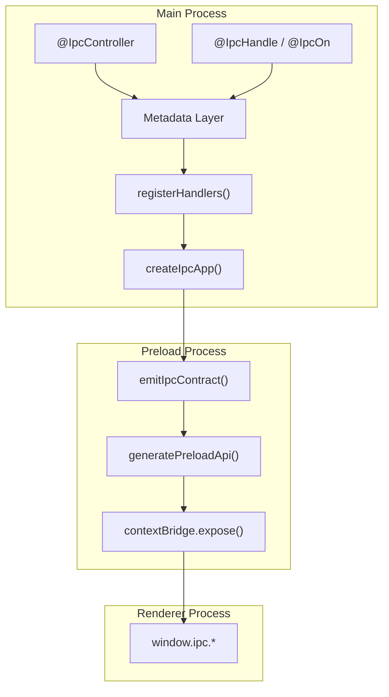

# electron-ipc-controller

## Overview

This library provides a **class-based IPC abstraction for Electron**, inspired by NestJS-style controllers. It transforms Electron's string-based IPC into a structured, observable, type-safe API system.

## Project Architecture

