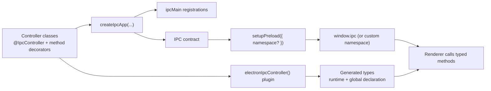

# Architecture Overview

This library has two cooperating layers:

1. **Runtime layer (`@electron-ipc-bridge/core`)**
   - Registers controller handlers on Electron `ipcMain`
   - Injects event-derived parameters (`@Sender()`, `@Window()`, `@RawEvent()`, etc.)
   - Optionally wraps handler execution in correlation context

2. **Build layer (`@electron-ipc-bridge/vite-plugin`)**
   - Parses `createIpcApp(...)` from your main entry
   - Finds controllers and extracts handler signatures
   - Generates renderer-facing type artifacts (`ipc.types.ts` and `ipc.d.ts`)

## End-to-end flow

## Design constraints

- Controllers must be statically discoverable from `createIpcApp(...)` for type generation to work.
- Duplicate namespaces are rejected at app creation time.
- The preload `namespace` must match what the renderer expects (defaults to `ipc`).
