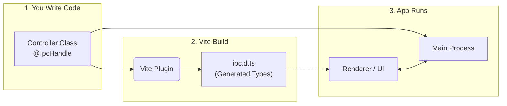

# Introduction

Electron IPC Bridge is a **type-safe, class-based** IPC framework for [Electron](https://www.electronjs.org/) applications.

Inspired by [NestJS](https://nestjs.com/), this library allows you to structure your Electron Main Process logic using **Controllers** and **Decorators**. It includes a [Vite](https://vitejs.dev/) plugin that automatically generates [TypeScript](https://www.typescriptlang.org/) definitions for your Renderer process, ensuring your renderer and main process types are always in sync without manual duplication.

- Channels become an implementation detail. They're dynamically generated when the app is created, and automatically passed to the preload script.
- The [`IpcMainEvent`](https://www.electronjs.org/docs/latest/api/structures/ipc-main-event)/[`IpcMainInvokeEvent`](https://www.electronjs.org/docs/latest/api/structures/ipc-main-invoke-event) is abstracted away by default, but easily accessible with the `@RawEvent()` decorator
- Types are auto-generated for the renderer process, meaning you don't need to manually create shared DTOs
- You never need to touch [`ipcMain.handle`](https://www.electronjs.org/docs/latest/api/ipc-main#ipcmainhandlechannel-listener)(...) or [`ipcRenderer.invoke`](https://www.electronjs.org/docs/latest/api/ipc-renderer#ipcrendererinvokechannel-args)(...)
- There's no need for manual preload wire-up
- Easy mapping from a class-based structure into [Electron's IPC](https://www.electronjs.org/docs/latest/api/ipc-main) mechanisms

## At a Glance

The library bridges your main and renderer processes using shared types generated at build time.

### 1. Create a Controller (Main Process)

```typescript
import { IpcController, IpcHandle } from "@electron-ipc-bridge/core";

@IpcController("users")
export class UserController {
  @IpcHandle()
  async getUser(id: string) {
    // Return standard objects, promises, or throw errors
    return { id, name: "Alice" };
  }
}
```

### 2. Use in Renderer (Frontend)

```typescript
// Fully typed, auto-completed invocation
const user = await window.ipc.users.getUser("123");

console.log(user.name); // "Alice"
```

## How It Works



This library consists of two main parts working in tandem:

1. **Runtime (`@electron-ipc-bridge/core`):**
   - Uses TypeScript decorators to register class methods as [`ipcMain`](https://www.electronjs.org/docs/latest/api/ipc-main) handlers.
   - Handles parameter injection (e.g., getting the [`BrowserWindow`](https://www.electronjs.org/docs/latest/api/browser-window#class-browserwindow-extends-basewindow) or [`WebContents`](https://www.electronjs.org/docs/latest/api/web-contents#class-webcontents) directly in your method).
   - Manages the `preload` script to expose a type-safe API bridge.

2. **Build-time (`@electron-ipc-bridge/vite-plugin`):**
   - Statically analyses your Controller classes.
   - Generates:
     - a runtime TypeScript module with your IPC API and shared types
     - a `d.ts` declaration file that augments `window` with that API
   - Ensures that if you change a method signature in the backend, the frontend build will fail if not updated.

## Mental Model

- Controllers live in the Main process
- Methods become IPC endpoints
- The preload exposes a safe, typed facade
- The renderer only ever talks to `window.ipc`

## Motivation

After building my own non-trivial Electron app, I found that too much time was spent updating the preload script and renderer types, defining constants for channel names, and maintaining shared configurations for API types. I originally built a much simpler version of this library for my own use, but I thought genericising and publishing it might help others who take a class-based approach to their application's backend.

## Next steps

See the [Quickstart](./quickstart.md) to install and run your first controller.
